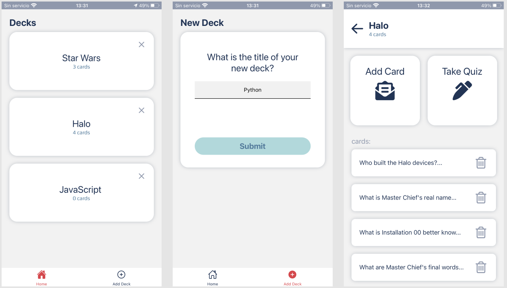
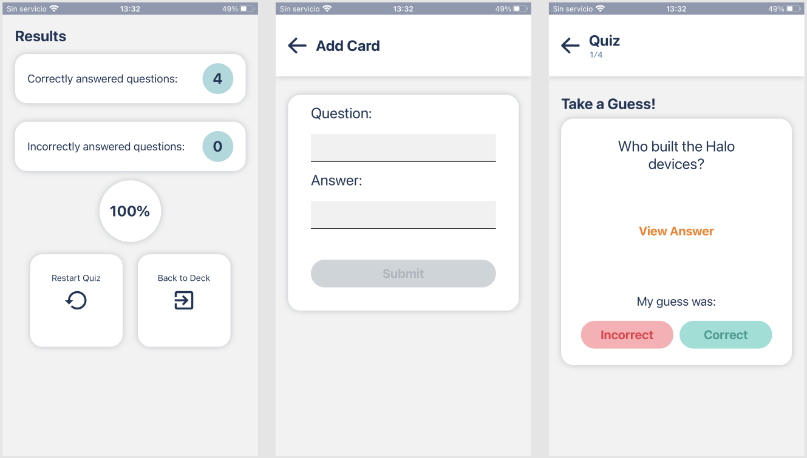

# MOBILE FLASHCARDS

Mobile Flashcards is the final Udacity React Nanodegree project to help learner showcase what he or she has learned in react native

## Installation

Clone this repository and run

```bash
git clone https://github.com/Jokmonsimon/MobileFlashcards.git
```

Run

```bash
yarn or npm install
```

## Usage

to start the app simply run:

```bash
yarn start
```

then you can scan the QR code with your smart phone to use the app or you can run it with the web option.

this app has being tested in the following devices (iphone 7 plus, iphone X, ipad pro)

## Contributing

Pull requests are welcome. For major changes, please open an issue first to discuss what you would like to change.

Please make sure to update tests as appropriate.

## Images of the App




# Author

## Refereneces

Gary Vladimir Núñez López
